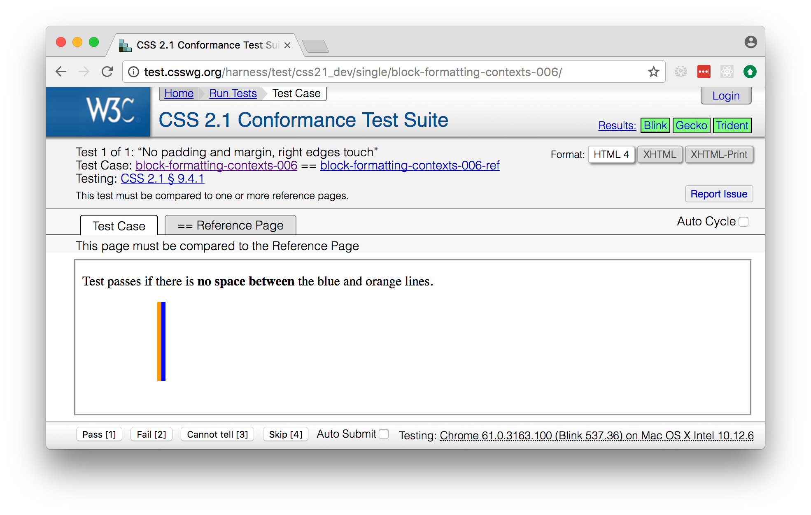
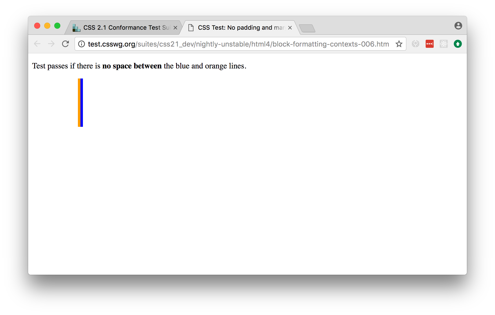
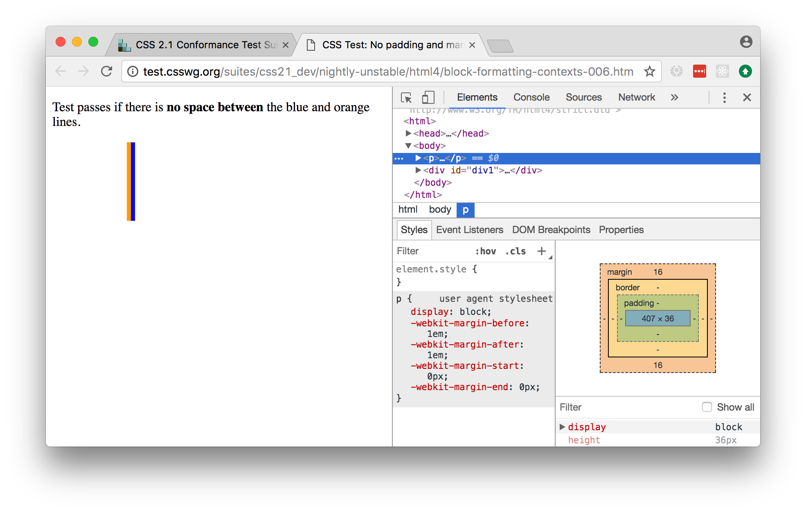
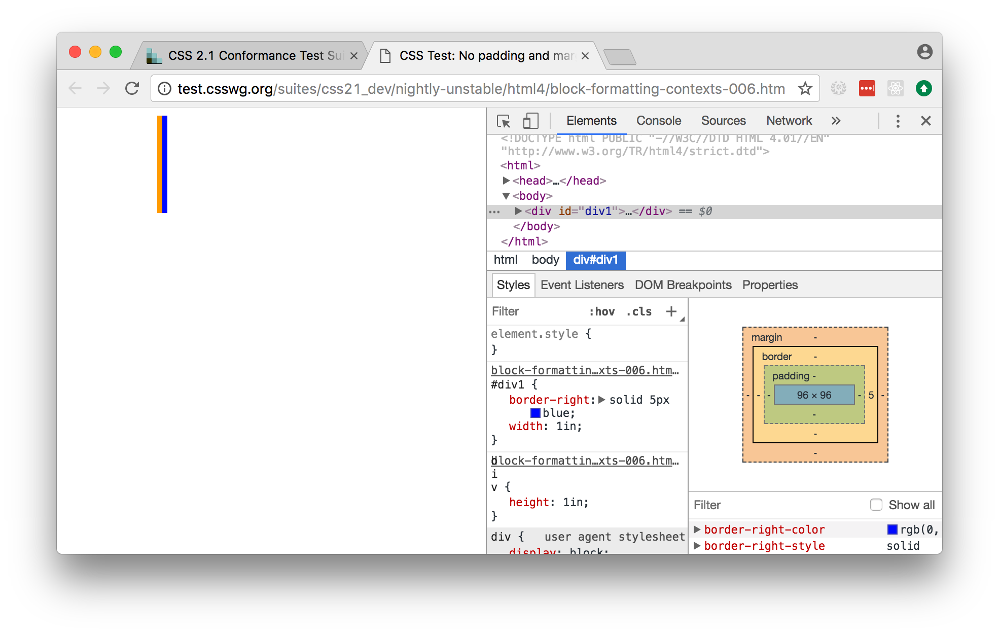

.. _contribute:

==============================
How to contribute to Colosseum
==============================

This guide will help walk you through the process of contributing your first
contribution to Colosseum.

Set up your development environment
===================================

Go to the `Colosseum repository on GitHub <https://github.com/pybee/colosseum>`__,
and fork the repository into your own Github account.

Then, you need to set up your development environment. To work on Colosseum, you'll need Python 3.4+ installed on your computer. Create a virtual environment, and clone your Colosseum
fork::

    $ mkdir beeware
    $ cd beeware
    $ python3 -m venv venv
    $ source venv/bin/activate
    $ git clone git@github.com:<your github username>/colosseum.git
    $ cd colosseum

You can then run the test suite::

    $ python setup.py test

This will run around 2300 tests - most of which are currently marked as
"expected failures". This means that we have the test, but we *know* that
they're failing at the moment, for reasons that we understand -- usually, that
we just haven't implemented the section of the CSS specification that the test
is exercising.

You shouldn't *ever* get any **FAIL** or **ERROR** test results. We run our
full test suite before merging every patch. If that process discovers any
problems, we don't merge the patch. If you *do* find a test error or failure,
either there's something odd in your test environment, or you've found an edge
case that we haven't seen before - either way, let us know!

Now you are ready to start hacking on Colosseum. Have fun!

What should I do?
=================

Having run the test suite, you now know which tests are currently expected
failures. Your task is to take one of these tests, and make whatever
modifications are necessary to get that test into a passing state, without
breaking any other tests.

About the test suite
--------------------

The bulk of Colosseum's test suite is automatically generated based on the
W3C's `Web Platform Tests <https://github.com/w3c/web-platform-tests/>`__.
This is the canonical test suite for W3C standard compliance.

Unfortunately, this test suite is very browser centric, and isn't an automated
test suite. It relies on a human loading a series of web pages, and comparing
each page against a reference rendering. This is necessary in a web context,
because browsers are allowed to have minor variations in rendering. However,
it's a problem for Colosseum, for two reasons: firstly, because we want a
fully automated test suite; but also because we're not targetting a web
browser, so "load this web page" isn't a test we can use.

So - Colosseum's ``utils`` directory has a set of scripts that take the W3C
repository, and converts each page into raw data. It uses `Toga
<https://pybee.org/toga>`__ to create a 640x480 web view, loads the test
document, and then injects some Javascript to extract the document structure
and the rendering information about the document.

The output of this process is two documents - a `data` file, and a
`reference` file.

The `data` file contains a JSON-formatted version of the DOM elements in the
test, with their style declarations.

The `reference` file contains the same DOM structure - but instead of
recording the style, it records the size, position, borders, padding and
margin of each element in the DOM.

The test suite takes the data file, reconstructs the DOM nodes in Colosseum,
and apply the test styles to those nodes. It then lays out the document, and
evaluates if the size and position of each DOM node in the document matches
that in the reference rendering.

Effectively, what we're doing is checking that given the same inputs,
Colosseum will produce the same output as the web view - except that we don't
ever have to draw anything on a screen. We're checking the layout at a basic
mathematical level.

Of course, this assumes that the web view that was used to render the document
is, itself, correct. The test suite was generated on a Mac using a Safari 11
Webkit webview, so the CSS2 components **should** be fully compliant; however,
some CSS3 tests (especially in the flexbox and grid modules) may be incorrect.

Picking a test
--------------

All the tests are located under the tests directory. Each test directory contains 
a ``not_implemented`` file. This is a list of tests that are currently known to 
fail - because the logic necessary to make the test pass isn't implemented. 
Pick one of these tests, and delete it from the ``not_implemented`` file.

For the purposes of this example, we're going to pick the
``block-formatting-contexts-006`` test in ``web_platform/CSS2/normal_flow/test_block_formatting_contexts``(this test is no longer available, as it has already been fixed). 

The first test run
------------------

Each test file contains a single test class. In order to run the test, you must specify
the path to this class, separated by dots. For our example, you can run the single test 
out of the test suite::

    $ python setup.py test -s tests.web_platform.CSS2.normal_flow.test_block_formatting_contexts.TestBlockFormattingContexts.test_block_formatting_contexts_006

This will produce a lot of console output. This output will start with some
lines that tells you that the test is being set up and run::

    running test
    running egg_info
    writing dependency_links to colosseum.egg-info/dependency_links.txt
    writing colosseum.egg-info/PKG-INFO
    writing top-level names to colosseum.egg-info/top_level.txt
    reading manifest file 'colosseum.egg-info/SOURCES.txt'
    reading manifest template 'MANIFEST.in'
    writing manifest file 'colosseum.egg-info/SOURCES.txt'
    running build_ext

Then, it will output the name of the test being executed, and whether it
passed or failed::

    test_block_formatting_contexts_006 (tests.web_platform.CSS2.normal_flow.test_block_formatting_contexts.TestBlockFormattingContexts)
    When there is no padding or margins on elements the right outer edge of the child box will touch the right edge of the containing block. ... FAIL

It then gives you a detailed description of **why** the test failed::

    ======================================================================
    FAIL: test_block_formatting_contexts_006 (tests.web_platform.CSS2.normal_flow.test_block_formatting_contexts.TestBlockFormattingContexts)
    When there is no padding or margins on elements the right outer edge of the child box will touch the right edge of the containing block.
    ----------------------------------------------------------------------

This description comes from the W3C test suite - it might point you in the
right direction, or it might not.

You'll then see the stack trace at the point the test failed::

    Traceback (most recent call last):
      File "/Users/rkm/projects/beeware/colosseum/tests/utils.py", line 360, in test_method
        '\n' + '\n'.join(extra)
      File "/Users/rkm/projects/beeware/colosseum/tests/utils.py", line 277, in assertLayout
        self.fail('\n'.join(output))
    AssertionError:

This will tell you the line of code where the test failed. However, as our
test is automatically generated, this won't really tell you much, other than
the fact that the test generation code is all in ``tests/utils.py``.

What *is* helpful is the next piece of output::

    ~~~~~~~~~~~~~~~~~~~~~~~~~~~~~~~~~~~~~~~~~~~~~~~~~~~~~~~~~~~~~~~~~~~~~~~~~~~~~~~~
        * <body> 624x96 @ (8, 8)
                 padding: 624x96 @ (8, 8)
                 border: 624x96 @ (8, 8)
            * 
 96x96 @ (8, 8)
                    padding: 96x96 @ (8, 8)
                    border: 101x96 @ (8, 8)
                * 
 91x96 @ (8, 8)
                        padding: 91x96 @ (8, 8)
    >>                  padding: 96x96 @ (8, 8)
                        border: 96x96 @ (8, 8)
    ~~~~~~~~~~~~~~~~~~~~~~~~~~~~~~~~~~~~~~~~~~~~~~~~~~~~~~~~~~~~~~~~~~~~~~~~~~~~~~~~

This is a comparison between what was generated by Colosseum, and what was
expected. In this example, the two documents are almost identical, except for
the padding box of one element. Colosseum has determined that the padding box
is 96 pixels wide (the line indicated with the ``>>`` marker); the reference
rendering says it should be 91 pixels wide.

The test output then gives us some pointers for where to look in the standard
for the rules that need to be followed::

    See http://www.w3.org/TR/CSS21/visuren.html#block-formatting

and the W3C test itself::

    Test: http://test.csswg.org/harness/test/css21_dev/single/block-formatting-contexts-006/

lastly, as the test shuts down, we get some summary output for the test run::

    ----------------------------------------------------------------------
    Ran 1 test in 0.005s

    FAILED (failures=1)
    Test failed: <unittest.runner.TextTestResult run=1 errors=0 failures=1>
    error: Test failed: <unittest.runner.TextTestResult run=1 errors=0 failures=1>

This example shows a case where the code is running to completion without
error, but is generating incorrect output. It's also possible that you might
see errors caused when the code cannot run to completion. For example, in the
following case, a ``None`` value has mistaken leaked into a padding box
calculation::

      File "/Users/rkm/projects/beeware/colosseum/colosseum/dimensions.py", line 594, in padding_box_width
        return self._padding_left + self._content_width + self._padding_right

    TypeError: unsupported operand type(s) for +: 'int' and 'NoneType'

You may also see exceptions that are raised specifically mentioning parts of
the CSS specification that have not yet been implmemented. For example, this
exception would be raised if the layout example requires the rules of Section
9.4.2 of the CSS2.2 specification, but that section hasn't been implemented::

      File "/Users/rkm/projects/beeware/colosseum/colosseum/engine.py", line 239, in layout_box
        raise NotImplementedError("Section 9.4.2 - relative positioning")  # pragma: no cover

    NotImplementedError: Section 9.4.2 - relative positioning

Lastly, you might see errors where the rendering engine has become confused.
In this example, a impossible branch of code has been reached while
calculating a width of an element in normal flow::

      File "/Users/rkm/projects/beeware/colosseum/colosseum/engine.py", line 284, in calculate_width_and_margins
        raise Exception("Unknown normal flow width calculation")  # pragma: no cover

    Exception: Unknown normal flow width calculation

Ok! So we now have a failing test. What do we do about it?

Is the test case correct?
-------------------------

Since the test suite is automatically generated, and there are over 2000
tests, we can't be 100% certain that the test *itself* is correct. So - we
need to confirm whether the test itself is valid.

Click on the link `to the W3C test
<http://test.csswg.org/harness/test/css21_dev/single/block-formatting-contexts-006/>`__ that was in the test output. You should see a page that looks something like:

Using this view, confirm that the test acutally passes. In this case, the page
tells us to compare to the reference page; you can flick between the "Test
Case" tab and the "Reference Page" tab and confirm that the output is as
expected.

.. note::

    Many of the tests in the test suite use a special font, called "Ahem".
    Ahem is a font that has a limited character set, but known (and simple)
    geometries for each character - for example, the M glyph (used to
    establish the size of the "em" unit) is a solid black square. This helps
    make test results repeatable. You'll need to `install this font
    <https://www.w3.org/Style/CSS/Test/Fonts/Ahem/>`__ before confirming the
    output of any test that uses it.

The reference rendering won't always be pixel perfect, so you'll need to check
any text on the page to see whether the test is passing in the browser.

If the test appears to be failing, then there's no point trying to reproduce
the browser's behavior in Colosseum! Look for a file called ``not_compliant``
in the same directory as the ``not_implemented`` file. If this file doesn't
exist - create it. Then, add to the `not_compliant` file the same line that
you *deleted* from ``not_implemented``. Rerun the test - it should come back
reporting as an expected failure::

    running test
    running egg_info
    writing colosseum.egg-info/PKG-INFO
    writing top-level names to colosseum.egg-info/top_level.txt
    writing dependency_links to colosseum.egg-info/dependency_links.txt
    reading manifest file 'colosseum.egg-info/SOURCES.txt'
    reading manifest template 'MANIFEST.in'
    writing manifest file 'colosseum.egg-info/SOURCES.txt'
    running build_ext
    test_block_formatting_contexts_006 (tests.web_platform.CSS2.normal_flow.test_block_formatting_contexts.TestBlockFormattingContexts)
    When there is no padding or margins on elements the right outer edge of the child box will touch the right edge of the containing block. ... expected failure

    ----------------------------------------------------------------------
    Ran 1 test in 0.004s

    OK (expected failures=1)

And you're done! You've just told the test suite that yes, the test will fail,
but because the Webkit test result isn't correct.

.. note::

    Most of the tests in the CSS test suite *should* pass. If you think you've
    found a failure in a CSS2 test, you should try and confirm with others
    before you submit your patch. You may find the `W3C's test results
    <http://test.csswg.org/harness/review/css21_dev/>`__ helpful - these are
    results reported by other users.

Sometimes, the test will pass, but it will be validating something that
Colosseum is not concerned with. For example, some of the tests deal with
behavior during DOM manipulation (insertion or removal of elements from the
DOM with JavaScript). DOM manipulation isn't something Colosseum is trying to
model, so this test isn't of any use to us. In this case, you should move the
test line from the ``not_implemented`` file to the ``not_valid`` file (again,
you may need to create this file if it doesn't exist). This flags that it is a
test that doesn't need to be executed at all.

If you find an invalid or non-compliant test, submit a pull request for the
change moving the line out of the ``not_implemented`` file, and you're done!
That pull request should detail *why* you believe the test in invalid, so that
the person reviewing your pull request understands your reasoning. You can now
pick another test, and work on your second pull request!

However, if the test passes, the next step is to try and fix it.

.. note::

    If you're a newcomer to Colosseum, and the test you've chosen involves
    rendering text, displaying an image, or testing the color of an element
    (other than where color is used purely to make an element visible), you
    might want pick another test to work on. The easiest tests to work on will
    involve the positioning of boxes on a page, without any images or text.

The raw test
------------

Near the top of the test suite page, there is a "Test Case:" label, followed
by two links. These are links to the raw documents that are used in the test.
If you click on the first link (the test document), you'll see a page that
looks just like the test case, but without the test harness around it:

In this test, the raw test page is a line of test instructions. This won't
exist on every test case; but if it *does* exist, we need to strip it out to
simplify the test for our purposes. Open the web inspector, select the ``
``
element corresponding to the test instruction:

Right click on the element, and select "Delete element". This will remove the
instruction from the page:

.. note::

    Sometimes, the test instruction *is* the test - for example, the test
    might read "This text should not be red". If this is the case, you
    *shouldn't* delete the instructional text. You only delete the
    instructional text if it is *purely* instructional - if it doesn't
    actually participate in the layout being tested.

Once you've deleted - for example, in the screenshot, you can see that the
``
`` element that is the child of the ``<body>`` should have a content size
of 96x96, and a right border of 5 pixels. We can compare this to the output
produced when we ran our test, and see that yes - during the test, the border
box was 101x96, the inner content was 96x96, but both the border box and the
inner content of that element had an origin of 8x8. This means the right
border extended 5 pixels past the content.

We can now start digging into the code to see if we can identify why the
margin box hasn't received the correct size.

Fixing the problem
------------------

At this point, you're in bug country! Every bug will have a slightly slightly
different cause, and it's your job to find out what is going on.

The entry point for rendering is the ``layout()`` method in
``colosseum/engine.py``. This method calls ``layout_box()`` recursively on the
document being rendered. The code in ``colosseum/engine.py`` is extensively
documented with references to the `CSS specification
<https://www.w3.org/TR/CSS/>`__ - especially the `CSS2.2 Specification
<https://www.w3.org/TR/CSS22/>`__, the `Flexible Box Layout Module
<https://www.w3.org/TR/css-flexbox-1/>`__, and the `Grid Layout Module
<https://www.w3.org/TR/css-grid-1/>`__. Any changes you make should be
include equally verbose documentation, and cross references to any paragraphs
in the specification.

The test suite uses a ``TestNode`` as the basis for it's document model. A
test node has three attributes of particular interest:

    * ``style``, storing the CSS style declaration that applies to the node.
      These values may be expressed in any units allowed by CSS (including
      pixels, points, em, percent, and more). The sub-attributes of the ``style``
      attribute match those of the CSS specification (e.g., ``width``,
      ``margin_top``, ``z_index``, and so on).

    * ``layout``, storing the computed values for the layout of the TestNode.
      These values are *always* in integer pixels. The layout describes the
      position of a content box (defined by ``content_top``, ``content_right``,
      ``content_bottom`` and ``content_left``), relative to the content box of
      it's parent (with an offset defined by ``offset_top`` and ``offset_left``).
      Surrounding the content box is a padding box, surrounded by a border box,
      surrounded by a margin box. These are also given in pixels, relative to
      the content box of the parent element.

    * ``children``, a list of TestNodes that are descendents of this node. A
      leaf node in the DOM tree is a node with an empty children list.

The layout algorithm roughly consists of:

    1. Set up and copy over initial layout values by computing the style
       values.

    2. Calculate the width of the node

    3. Iterate over the children of the node

    4. Calulate the height of the node

    5. Make an adjustments for relative positioning.

Dig into the code, and work out why Colosseum is giving the wrong result.

Re-run the test suite
---------------------

Once you've identified the problem, and the single test passes, you can re-run
the *entire* Colosseum test suite. One of three things will happen:

    1. The test suite will pass without any errors. In this case, you've fixed
       exactly one bug. Submit a pull request with your fix, and try another one!

    2. The test suite will report one or more FAIL or ERROR results. In this
       case, you've fixed one bug, but broken existing behavior in the process.
       This means there's something subtle wrong with your fix. Go back to the
       code, and see if you can find a way to make your chosen test pass
       *without* breaking other tests.

    3. The test suite will report one or more UNEXPECTED PASS results. This is
       good news - it means that the fix you've made has indirectly fixed one
       more more *other* tests! Quickly verify that those tests are valid (using
       the same process that you used to verify the test you *deliberately*
       fixed), and if they're valid tests, remove them from the ``not_implemented``
       file. Submit a pull request with your fix, and try another one!

What if the test itself is incorrect?
-------------------------------------

Since the reference test data is automatically extracted from a running
browser, and browsers don't provide a great API for extracting rendering data,
it's entirely possible that the reference test data that the test is using
might be incorrect. If you look at the test suite output, and it doesn't match
what you see in a browser, open a ticket describing what you've found. This
may indicate a bug in the reference rendering; which will require a fix to the
script that generates the test data.
